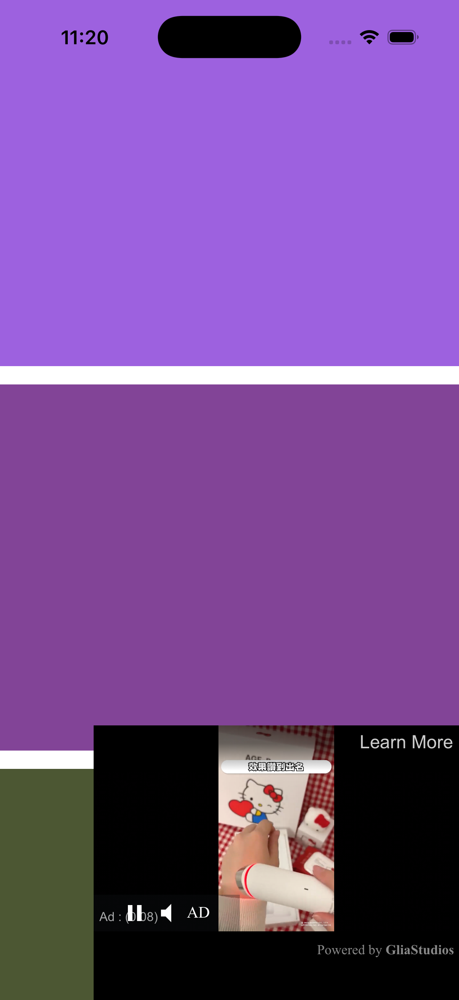
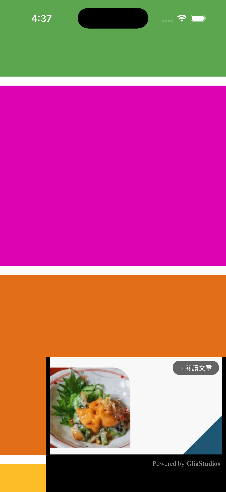

# Swift Ppackage Mmanager GliaPlayer

This document explains how to integrate the GliaPlayer iOS SDK, a WebView-based video ad player, into an iOS project.

---

## Scenarios
| Ads | Content Video|
|-------------------------|-------------------------|
| |   |
| |   |  

## Requirements

* iOS platform 14+ (Required by GliaPlayer)

---

## Step 1: Configure Google Mobile Ads SDK

In `ios/Runner/Info.plist`, add this config:

```xml
<dict>
	<key>GADIntegrationManager</key>
	<string>webview</string>
</dict>
```

---

## Step 3: Usage

The sample code below shows how to add GliaPlayerView to the UI layout so that it always sticks to the bottom right corner of the screen.

```swift
import SwiftUI
import GliaPlayer

struct ContentView: View {
    var body: some View {
        ZStack(alignment: .bottomTrailing) {
            // The scrolling background content
            ScrollView {
                VStack(spacing: 16) {
                    ForEach(0..<100, id: \.self) { _ in
                        Rectangle()
                            .fill(Color(
                                red: Double.random(in: 0...1),
                                green: Double.random(in: 0...1),
                                blue: Double.random(in: 0...1)
                            ))
                            .frame(height: 320)
                            .frame(maxWidth: .infinity)
                    }
                }
            }
            
            // The floating player
            GliaPlayerView(slotKey: "gliacloud_app_test")
                .frame(width: 320, height: 240)
        }
        .edgesIgnoringSafeArea(.all)
    }
}
```

---

---

## References

* [Google Mobile Ads - WebView integration](https://developers.google.com/admob/ios/browser/webview)